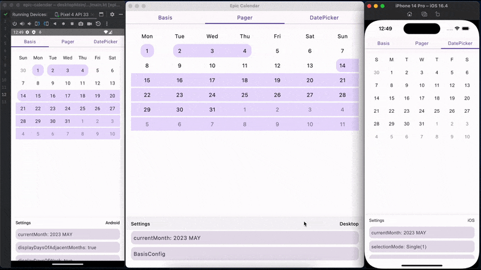

# Epic Calendar

Compose Multiplatform library for displaying epic calendars.

### ATTENTION

This library is super experimental!



### Kotlin Multiplatform supported targets
- android
- ios
- jvm
- js

### Dependencies

The library is published on MavenCentral.

```Kotlin
dependencies {
    commonMainImplementation("io.github.epicarchitect:epic-calendar-compose:1.0.6")
}
```

### Basis calendar setup

```kotlin
BasisEpicCalendar(
    state = rememberBasisEpicCalendarState(
        config = rememberBasisEpicCalendarConfig(
            rowsSpacerHeight = 4.dp,
            dayOfWeekViewHeight = 40.dp,
            dayOfMonthViewHeight = 40.dp,
            columnWidth = 40.dp,
            dayOfWeekViewShape = RoundedCornerShape(16.dp),
            dayOfMonthViewShape = RoundedCornerShape(16.dp),
            contentPadding = PaddingValues(0.dp),
            contentColor = Color.Unspecified,
            displayDaysOfAdjacentMonths = true,
            displayDaysOfWeek = true
        )
    )
)
```

If you want to change config dynamically, use `rememberMutableBasisEpicCalendarConfig()`.
If you want to change state dynamically, use `rememberMutableBasisEpicCalendarState()`.

### Pager calendar setup

```kotlin
EpicCalendarPager(
    state = rememberEpicCalendarPagerState(
        config = rememberEpicCalendarPagerConfig(
            basisConfig = rememberBasisEpicCalendarConfig(
                contentColor = Color.Red
            )
        )
    )
)
```

The `EpicCalendarPager` is based on a `BasisEpicCalendar` so it accepts a `basisConfig`,
you can pass it using `rememberEpicCalendarPagerConfig`.
So you can customize the appearance using `rememberBasisEpicCalendarConfig`.

### Date picker setup

```kotlin
EpicDatePicker(
    state = rememberEpicDatePickerState(
        config = rememberEpicDatePickerConfig(
            pagerConfig = rememberEpicCalendarPagerConfig(
                basisConfig = rememberBasisEpicCalendarConfig(
                    displayDaysOfAdjacentMonths = false
                )
            ),
            selectionContentColor = MaterialTheme.colorScheme.onPrimary,
            selectionContainerColor = MaterialTheme.colorScheme.primary
        )
    )
)
```

The `EpicDatePicker` is based on a `EpicCalendarPager` so it accepts a `pagerConfig`,
you can pass it using `rememberEpicDatePickerConfig`.

### Date picker selection mode

Date picker has 3 features to pick dates:

- Single date selection
- Multiple date selection
- Date range selection

```kotlin
EpicDatePicker(
    state = rememberEpicDatePickerState(
        // for range
        selectionMode = EpicDatePickerState.SelectionMode.Range,
        // or for single date
        selectionMode = EpicDatePickerState.SelectionMode.Single(),
        // or for multiselect
        selectionMode = EpicDatePickerState.SelectionMode.Single(maxSize = 5)
    )
)
```

Selected dates can be obtained from `state.selectedDates`.

### Draw ranges

To draw ranges use `Modifier.drawEpicRanges(ranges, color)`
from `io.github.epicarchitect:calendar-compose-ranges`.

```Kotlin
val myRanges: List<ClosedRange<kotlinx.datetime.LocalDate>>
val myRangeColor: androidx.compose.ui.graphics.Color

// for simple BasisEpicCalendar
BasisEpicCalendar(
    modifier = Modifier.drawEpicRanges(
        ranges = myRanges,
        color = myRangeColor
    )
)

// and for pager
EpicCalendarPager(
    pageModifier = { page ->
        Modifier.drawEpicRanges(
            ranges = myRanges,
            color = myRangeColor
        )
    }
)
```

### Provide setup globally

At the moment this is a very experimental thing,
but you can pass the default settings using
`LocalBasisEpicCalendarConfig`, `LocalEpicCalendarPagerConfig`, `LocalEpicDatePickerConfig`

```kotlin
val defaultBasisConfig = defaultBasisEpicCalendarConfig().copy(
    contentPadding = PaddingValues(horizontal = 16.dp),
    displayDaysOfAdjacentMonths = false,
    displayDaysOfWeek = false,
    dayOfMonthViewShape = RoundedCornerShape(8.dp),
    rowsSpacerHeight = 2.dp
)
val defaultPagerConfig = defaultEpicCalendarPagerConfig().copy(
    basisConfig = defaultBasisConfig
)
val defaultDatePickerConfig = defaultEpicDatePickerConfig().copy(
    pagerConfig = defaultPagerConfig,
    selectionContainerColor = MaterialTheme.colorScheme.primary,
    selectionContentColor = MaterialTheme.colorScheme.onPrimary
)
CompositionLocalProvider(
    LocalBasisEpicCalendarConfig provides defaultBasisConfig,
    LocalEpicCalendarPagerConfig provides defaultPagerConfig,
    LocalEpicDatePickerConfig provides defaultDatePickerConfig
) {
    YourApplicationThatUsesEpicCalendars()
}
```

### Samples

More examples can be found in the [sample directory](sample).
